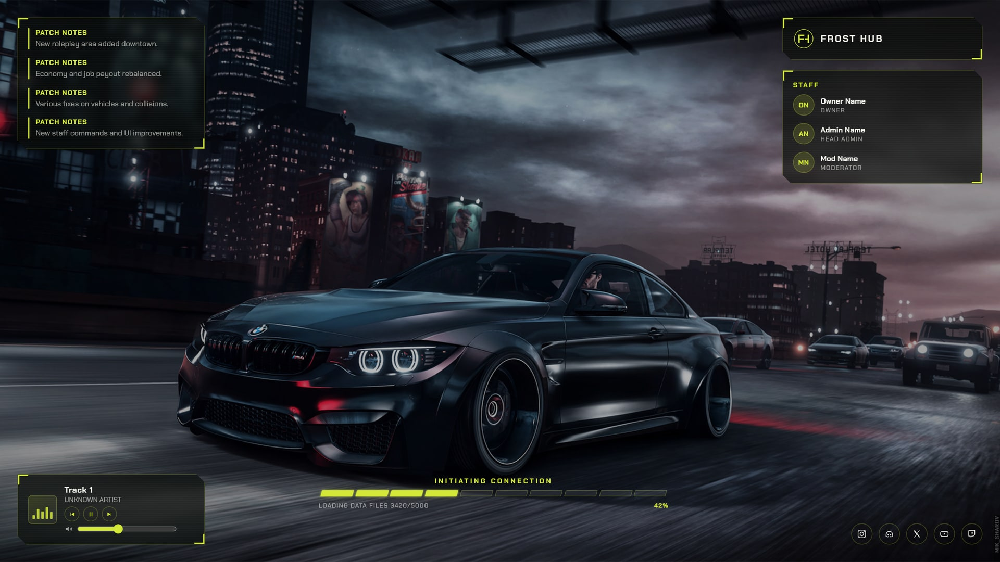
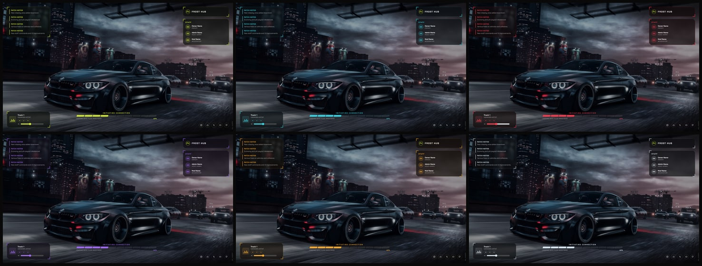
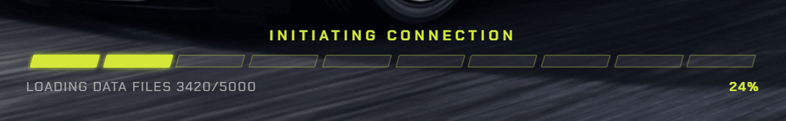
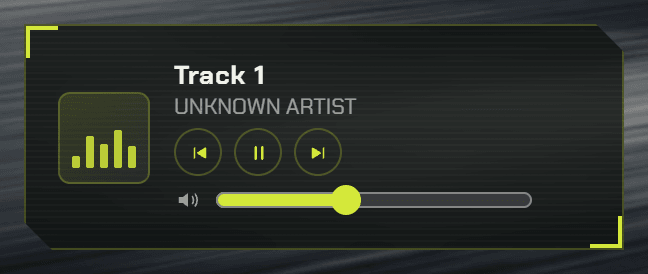
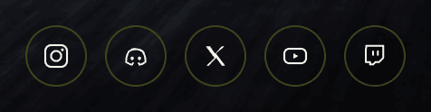
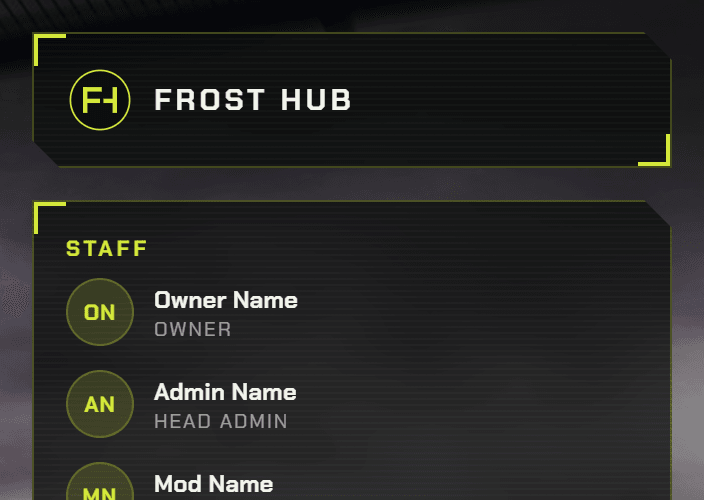
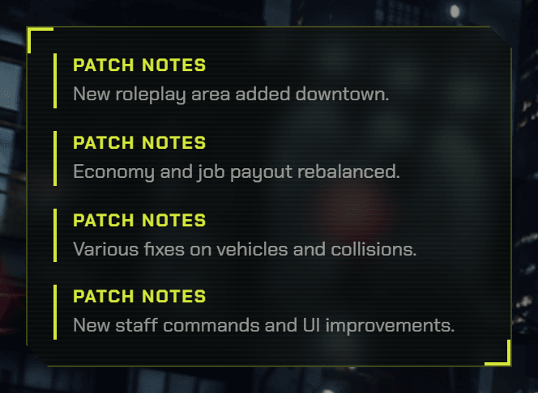

# FiveM Loading Screen

[](LICENSE)

A free, customizable FiveM loading screen, compatible with **QBCore** and
**QBX**. Loading screens are standalone (they run before any framework
loads), so there's no dependency to install.

**Included languages:** English (default), Italian, Spanish, French.



---

## Installation

1. Copy the folder into your server's `resources` directory.
2. Add to your `server.cfg`:

   ```
   ensure frosthub_loadingscreen
   ```

3. Restart the server.

> If you rename the folder, also update the name after `ensure` and the
> `name` field inside `fxmanifest.lua`.

---

## Quick customization

Almost everything is configured from **`html/js/config.js`**. The three
things you'll want to change first:

```js
language: "en",              // en | it | es | fr
theme: "lime",                // lime | cyan | crimson | violet | amber | ice
server: {
    name: "YOUR SERVER",
    logo: "img/logo.svg",
},
```

> **You can't break the loading screen by misconfiguring it.** If you delete
> a key, a whole block, or make a typo, the script automatically falls back
> to a safe default and the screen still starts. Feel free to remove any
> section you don't use.

---

## Language & translations

Set `language` in `config.js` to `"en"`, `"it"`, `"es"` or `"fr"`.

Every interface text (panel titles, loading messages, player labels) lives
in **`html/js/locales.js`**. To add a language: copy a whole block, rename
it (e.g. `de`), translate the values and set `language: "de"`.

Your own content (patch notes, staff roles) is written in `config.js` and
accepts **two formats**:

```js
// a single language
role: "Head Admin",

// or one version per language
role: {
    en: "Head Admin",
    it: "Admin Capo",
    es: "Administrador Jefe",
    fr: "Administrateur en chef",
},
```

The same applies to `title` and `text` of every entry in `patchNotes`.

---

## Colors



The fastest way is to pick a preset with `theme` (defined in
`html/js/themes.js`):

| Preset | Style |
|---|---|
| `lime` | lime green, street racing (default) |
| `cyan` | cyan, tech / cyberpunk |
| `crimson` | red, aggressive |
| `violet` | purple, nightlife / nightclub |
| `amber` | amber, warm |
| `ice` | icy white, minimal |

Want to tweak just one shade? Anything set in `colors` **overrides** the
preset, so you can start from one and change the bare minimum:

```js
theme: "cyan",
colors: {
    accent: "#00ff88",   // only the accent, the rest stays from the preset
},
```

Available keys: `accent`, `accentSoft`, `background`, `panelBg`,
`panelBorder`, `textPrimary`, `textSecondary`, `barEmpty`, `barFilled`.
To create your own preset, copy a block in `themes.js` and reference it
from `theme`.

---

## Background

`background.type` decides what is displayed:

- **`"particles"`** — animated particles, no file required.
- **`"image"`** — a single image: `background.image: "img/name.jpg"`.
- **`"slideshow"`** — several images cycling with a crossfade: list them in
  `background.images` and tune `slideshow.interval` (time per image) and
  `slideshow.fade` (crossfade duration).
- **`"video"`** — a looping video: `background.video: "img/name.mp4"`
  (mp4/webm, keep it light). Must stay muted for autoplay.

`background.overlayOpacity` controls how much the background is darkened
under the panels.

---

## Progress bar & real loading status



```js
progressBar: {
    blocks: 10,          // number of blocks
    showPercentage: true,
    realStatus: true,
},
```

With **`realStatus: true`** the text under the bar shows what the game is
actually loading, hooked into FiveM's native events: script preparation,
data file progress with a real counter (*"Loading data files 3420/5000"*),
map building. With `false` it shows generic messages based only on the
percentage.

---

## Music



Put the files in `html/sounds/` and list them in `config.js`:

```js
musicPlayer: {
    autoplay: true,
    startVolume: 0.4,
    tracks: [
        { title: "Track name", artist: "Artist", file: "sounds/track1.mp3" },
    ],
},
```

The player sits bottom-left with play/pause, next/previous, volume and an
animated equalizer. It auto-advances to the next track when one ends.
With no tracks configured it stays visible but disabled.

---

## Socials



Add or remove entries from the `socials` array:

```js
socials: [
    { icon: "instagram", url: "https://instagram.com/yourpage", enabled: true },
    { icon: "discord",   url: "https://discord.gg/yourinvite",  enabled: true },
],
```

Icons available in `html/js/icons.js`: `instagram`, `discord`, `twitter`,
`youtube`, `twitch`, `tiktok`, `kick`, `website`, `facebook`. To add a new
one, paste an SVG in that file with a key of your choice and reference it
here.

---

## Staff



Shows your staff team on the right side, each with their Discord avatar.
Add or remove entries from the `staff` array in `config.js`:

```js
staff: [
    { name: "YourName", role: "Owner", avatar: "https://cdn.discordapp.com/avatars/123456789012345678/xxxx.png" },
    { name: "AnotherName", role: "Head Admin", avatar: "https://cdn.discordapp.com/avatars/123456789012345678/xxxx.png" },
],
```

To grab a real, always-up-to-date avatar link: open Discord, right-click
the person's profile picture and choose **Copy Avatar URL**, then paste it
as-is into `avatar`. Since it's a live link to Discord's CDN, it updates
automatically whenever that person changes their avatar — nothing to
re-upload. If a link ever breaks (deleted account, wrong URL, no avatar
set) the picture is replaced with the person's initials, so the layout
never breaks. You can also point `avatar` to a local file in `html/img/`
instead of a Discord link.

---

## Screen shutdown

By default the screen **stays visible until the player is actually in the
city**, avoiding the flicker where the map is still popping in. The logic
lives in `client.lua`:

```lua
extraDelay = 2,     -- extra seconds after the session is ready
maxWait = 120,      -- safety net: closes anyway after N seconds
```

Raise `extraDelay` if you want players to see the screen longer. Prefer
FiveM's standard behavior instead? Set `loadscreen_manual_shutdown 'no'` in
`fxmanifest.lua` and remove the `client_script 'client.lua'` line.

---

## Mouse cursor

The cursor is enabled by the directive in `fxmanifest.lua`:

```lua
loadscreen_cursor 'yes'
```

It's needed so players can click the social links and use the music player
controls. Without this line FiveM hides the cursor and the screen becomes
unclickable. If you prefer a purely decorative screen, remove the line (or
set it to `'no'`).

---

## Panels




Every section can be toggled independently:

```js
panels: {
    musicPlayer:    true,
    serverCard:     true,
    staff:          true,
    featuredImages: true,
    patchNotes:     true,
    socials:        true,
},
```

`serverCard` is the small card with your logo and server name at the top
right. It has its own switch, so turning the staff list off does not take
the logo with it.

---

## Testing outside FiveM

Open `html/index.html` in a browser: since it won't receive FiveM's real
events, the script simulates a fake progress bar so you can preview the
visuals right away.

---

## Structure

```
frosthub_loadingscreen/
├── fxmanifest.lua
├── client.lua            <-- manual screen shutdown
├── README.md
└── html/
    ├── index.html
    ├── css/style.css
    ├── js/
    │   ├── config.js       <-- settings and content
    │   ├── locales.js      <-- texts in 4 languages
    │   ├── themes.js        <-- color presets
    │   ├── icons.js          <-- social icons
    │   └── script.js         <-- core logic (no need to edit)
    ├── fonts/                <-- Chakra Petch (SIL OFL, included)
    ├── img/                  <-- logo, backgrounds, featured images
    └── sounds/               <-- mp3/ogg for the player
```

---

## Credits

**Chakra Petch** font by Cadson Demak, distributed under the
[SIL Open Font License 1.1](html/fonts/LICENSE-ChakraPetch.txt) — bundled
with the resource so the look is identical on every PC, without depending
on system fonts or an internet connection.

---

## License

Released under the [MIT License](LICENSE) — free to use, modify and
redistribute, even in commercial projects, as long as the copyright notice
is kept. No warranty is provided.
